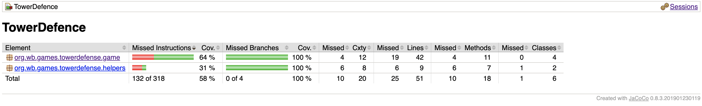

# Testausdokumentti

Ohjelmaa on testattu automatisoiduilla yksikkötesteillä. Testaus on jäänyt niukaksi haastavuudensa ja aikarajoitteiden vuoksi.

## Testikattavuus

Käyttöliittymä on jätetty testauksessa huomioimatta.

## Yksikkötestien rajoitteet

Sovellus käyttää Libgdx-kirjastoa, joka käyttää laajasti staattisia metodeja ja muuttujia. Tämä vaikeuttaa yksikkötestien kirjoittamista.