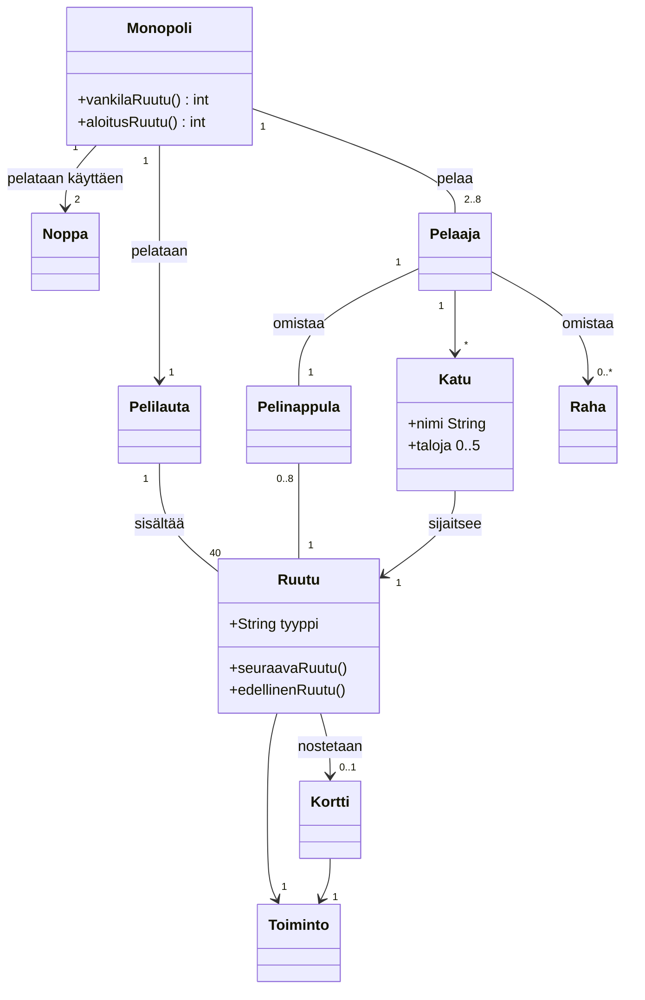

```mermaid
 classDiagram
      Monopoli "1" --> "1" Pelilauta : pelataan
      Monopoli "1" --> "2" Noppa : pelataan käyttäen
      Monopoli "1" -- "2..8" Pelaaja : pelaa
      Pelilauta "1" -- "40" Ruutu : sisältää
      Pelaaja "1" -- "1" Pelinappula : omistaa
      Pelinappula "0..8" -- "1" Ruutu
      Pelaaja "1" --> "*" Katu
      Ruutu --> "1" Toiminto
      Kortti --> "1" Toiminto
      Ruutu --> "0..1" Kortti : nostetaan
      Pelaaja --> "0..*" Raha : omistaa
      Katu --> "1" Ruutu : sijaitsee
      class Ruutu{
      +seuraavaRuutu()
      +edellinenRuutu()
      +String tyyppi
      }
      class Katu{
      +nimi String
      +taloja 0..5
      }
      class Monopoli{
      +vankilaRuutu() int 
      +aloitusRuutu() int
      }
```
